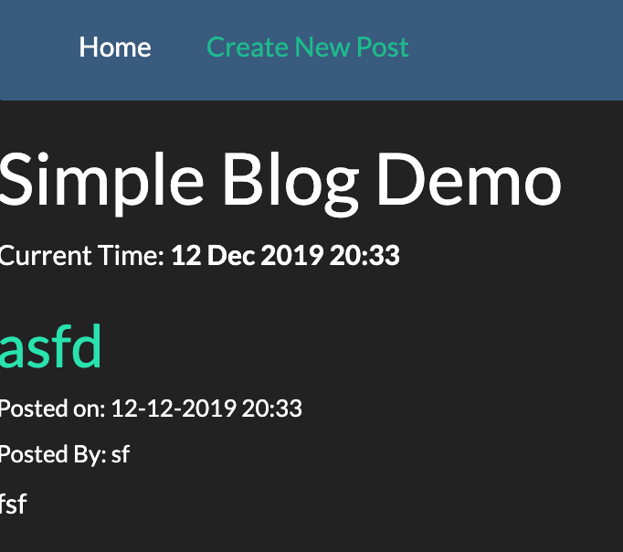

# SimpleBlogDemo

This is a Simple Blogging Application using Spring Boot, JPA, H2 in memory Database and Thymeleaf. 

The blogging application allows user to write new posts. All blog posts are displayed on the home page. Each blog post allows for comments.

<h3>To deploy locally</h3>

1) Git Clone this repo
2) Make sure your system has Java, Docker, and Maven installed
3) Run the dockerRun.sh script
4) Direct yourself to the Home Page : localhost:8090/home

<h3> View demo on AWS Instance </h3>

http://ec2-3-135-204-149.us-east-2.compute.amazonaws.com:8080/home

